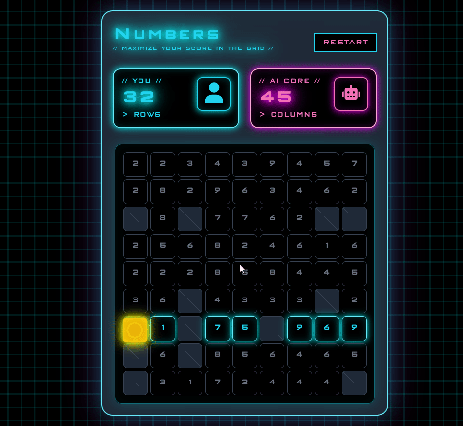

# Numbers

It is a board casual game. The objective is to get the highest numbers in the board to defeat the AI. It's running live [here](https://sosegon.github.io/numbers/)

## How to play

The game's been created to be quite intuitive. There are three simple steps:

  1. **Select the direction of your moves**: In the first turn, you need to select the direction (horizontal or vertical) of your moves throughout the game. You do this by selecting one of the highlighted numbers.
  2. **Let the AI make its move:** Once you select a number, it is the AI's turn to make a move.
  3. **Select a number in your chosen direction:** Select one of the highlighted numbers in the direction you chose in step 1. Go to step 2.

The numbers selected by each players are added to the corresponding scores. The game ends under one of the following conditions:

  1. There are no more numbers in the board.
  2. One of the players cannot make a move.

The player with the highest score wins.

## Development

The game was built based on the code of another casual game [2048tricks](https://github.com/sosegon/2048tricks). There are three main scripts:

  - board.js: It contains the classes and functions that define the logic of the game.
  - index.js: It has the logic view.
  - localStorage: It is charge of saving the state of the game for future sessions.
