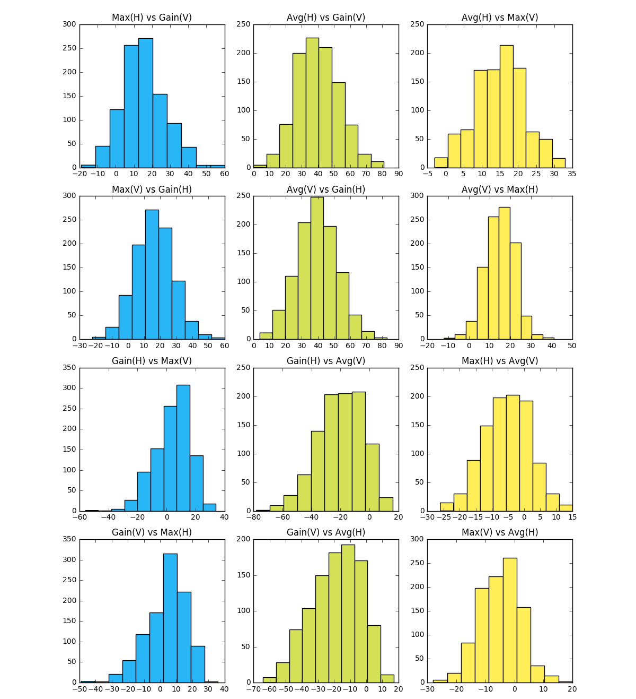
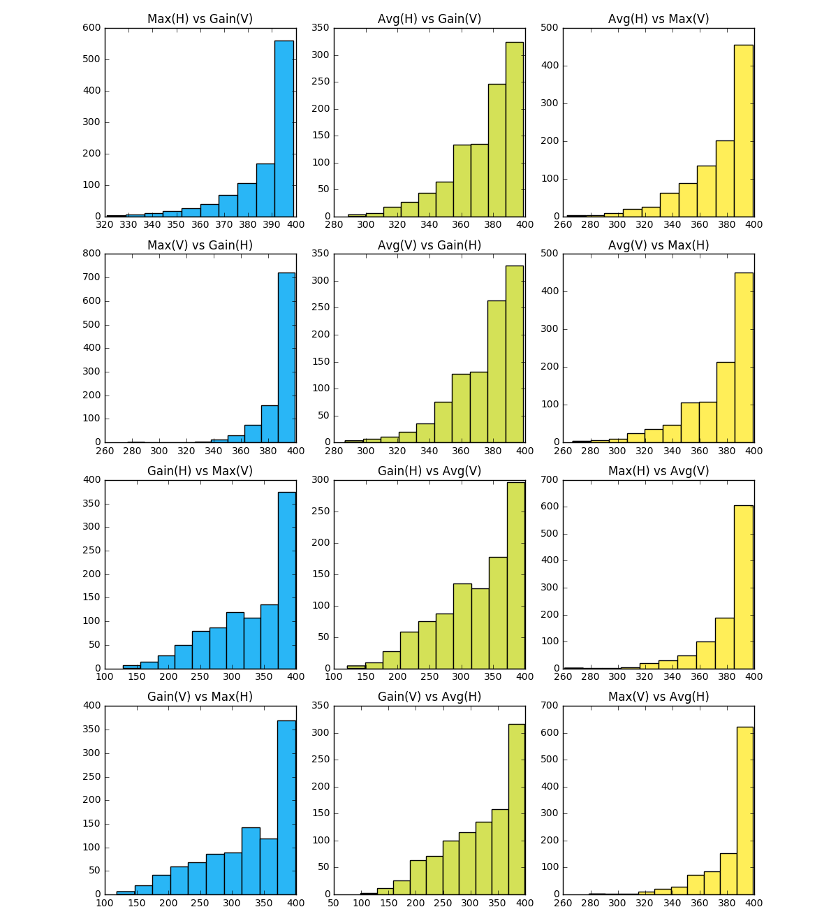

# Analysis of basic algorithms to play [Numbers](https://sosegon.github.io/numbers-demo/)

This experiment is meant to evaluate the performance of three basic algorithms to play the game. The ultimate objective is obtaining insights of the algorithms to further improve them.

## Metrics

The following metrics were considering to make the analysis:

**Score**: The score of an agent at the end of the game.

**Moves**: The number of moves made by an agent.

**Time**: The total time used by the agent to make decisions throughout the game. Eventually, this metric was not considered in the analysis since the output values for the current experiment were not significant.

## Experimental setup
The experiment made the following algorithms play against each other:

**Max**: The simplest one; the algorithm is explained [here](https://sosegon.github.io/numbers/#agentgetmaxvalueposition).

**Gain**: A bit more advanced, it looks forwards to consider the potential move of the other player. It is explained [here](https://sosegon.github.io/numbers/#agentgetmaxgainvalueposition).

**Avg**: Similar to the previous one; the algorithm is explained [here](https://sosegon.github.io/numbers/#agentgetbestaveragevalueposition).

Besides the algorithms, there were two other variables. The first one was the direction of each player: **HORIZONTAL** or **VERTICAL**. The second variable is the algorithm that starts the game. Based on these variables, the configurations seen in **Table 1** were established. As shown, a match between two algorithms required 4 different configurations.
  

| Player1 | Player2 | Direction1 | Direction2 |
| ------- | ------- | ---------- | ---------- |
| Max | Gain | HORIZONTAL | VERTICAL |
| Max | Gain | VERTICAL | HORIZONTAL |
| Gain | Max | HORIZONTAL | VERTICAL |
| Gain | Max | VERTICAL | HORIZONTAL |
| Avg | Gain | HORIZONTAL | VERTICAL |
| Avg | Gain | VERTICAL | HORIZONTAL |
| Gain | Avg | HORIZONTAL | VERTICAL |
| Gain | Avg | VERTICAL | HORIZONTAL |
| Avg | Max | HORIZONTAL | VERTICAL |
| Avg | Max | VERTICAL | HORIZONTAL |
| Max | Avg | HORIZONTAL | VERTICAL |
| Max | Avg | VERTICAL | HORIZONTAL |

Table 1. Configurations for the experiment.

 

The size of the [Board](https://sosegon.github.io/numbers/#board) was 20. That is, there were 399 selectable [Cells](https://sosegon.github.io/numbers/#cell).

To ensure the reliability of the results, the same game was played by each one of the 12 configurations. A total of 1000 games were played by each configuration.

## Results
The values of the metrics for each configuration were compiled in different ways. **Table 2** shows the number of wins for each algorithm.
  

| Player1 | Player2 | Direction1 | Direction2 | Wins1 | Wins2 | Ties |
| :-----: | :-----: | :--------- | :--------- | ----: | ----: | ---: |
| Max | Gain | HORIZONTAL | VERTICAL | 903 (90%)| 84 (8%)| 13 (2%)|
| Max | Gain | VERTICAL | HORIZONTAL | 910 (91%)| 79 (8%)| 11 (2%)|
| Gain | Max | HORIZONTAL | VERTICAL | 644 (64%)| 334 (33%)| 22 (3%)|
| Gain | Max | VERTICAL | HORIZONTAL | 659 (66%)| 319 (32%)| 22 (2%)|
| Avg | Gain | HORIZONTAL | VERTICAL | 999 (100%)| 0 (0%)| 1 (0%)|
| Avg | Gain | VERTICAL | HORIZONTAL | 1000 (100%)| 0 (0%)| 0 (0%)|
| Gain | Avg | HORIZONTAL | VERTICAL | 82 (8%)| 902 (90%)| 16 (2%)|
| Gain | Avg | VERTICAL | HORIZONTAL | 91 (9%)| 889 (89%)| 20 (2%)|
| Avg | Max | HORIZONTAL | VERTICAL | 983 (98%)| 7 (1%)| 10 (1%)|
| Avg | Max | VERTICAL | HORIZONTAL | 982 (98%)| 14 (1%)| 4 (1%)|
| Max | Avg | HORIZONTAL | VERTICAL | 216 (22%)| 735 (74%)| 49 (6%)|
| Max | Avg | VERTICAL | HORIZONTAL | 210 (21%)| 747 (75%)| 43 (4%)|

Table 2. Wins and ties for each configuration.

 

Overall, it is clear that the direction does not play an important role in the percentage of victories for each algorithm.

In the case of **Max** vs **Gain**, it is evident that the algorithm that starts the game has an advantage since the number of wins is always higher for the starter. This option seems to be leveraged by the **Max** algorithm much better than by **Gain**.

The results of **Avg** vs **Gain** are the most surprising ones. When **Avg** starts the game, **Gain** has no chance to win. On the other hand, when **Gain** starts the game, it has some chances to win; however, the superiority of **Avg** is quite evident.

Finally, **Avg** vs **Max** is similar to the previous case. The superiority of **Avg** is clear, however, **Max** did better than **Gain**.

**Figure 1** shows the histograms of score differences for each configuration. Score difference is the final score of Player1 minus the final score of Player2. For instance, the plot **Avg(V) vs Gain(H)** has only positive values since in this configuration **Avg** completely beat **Gain**.

 

**Figure 1. Histograms of score differences.**

 

The results in **Table 2** demonstrated the superiority of **Avg** in terms of the number of wins. The histograms confirm that superiority in terms of scores difference. For instance, **Max** and **Avg** beat **Gain** when they start the game. However, in a lot of games, the advantage for **Avg** is between 30 and 50. For **Max**, in an important number of games, the advantage is between 10 and 30. Since the **Avg** won almost all the games against **Gain**, it is easy to confirm its superiority. It is possible to say something similar about **Max**, but only when the algorithm starts the game.

**Figure 2** shows the histograms of the number of moves for each configuration. The number of moves is the sum of moves of Player1 and Player2. There are two important aspects to highlight. First, it is evident that in a relevant number of matches, the majority of [cells](https://sosegon.github.io/numbers/#cell) (or all of them) were taken. This is especially evident in the matches **Avg** vs **Max**.

In matches **Avg** vs **Gain**, the algorithms still take all the cells or the majority of them. However, there is an important number of games where the algorithms took between 200 and 300  cells. Given that the majority of games were won by **Avg**, it is safe to state that the algorithm beats the other one faster.

**Figure 2. Histograms of the number of moves.**

 

## Conclusions and further work
The experiment demonstrated the performance of the algorithms against each other. Based on the evidence, it is safe to rank the algorithms in the following way:

1. **Avg**
2. **Max**
3. **Gain**

This ranking may seem not expected due to the complexity of each algorithm. **Max** is the most basic one, it simply takes the higher available cell. **Gain** and **Avg** look one step ahead and make a selection based on the potential choices of the opponent. **Gain** is straightforward, it simply assesses the gain of each move based on the options for the opponent; then it maximizes that gain. **Avg** is similar to **Gain**, but the assessment takes into account the number of potential choices for the opponent; therefore, the lower the choices for the opponent, the higher the gain.

The algorithms just try to maximize the score, they do not take into account the state of the entire board or the score of the opponent. The next step would be to improve the algorithms using that information. For instance, the algorithms could try to end the game faster based on the score of the opponent. They could make selections that increase their scores and end the game if they are winning.

